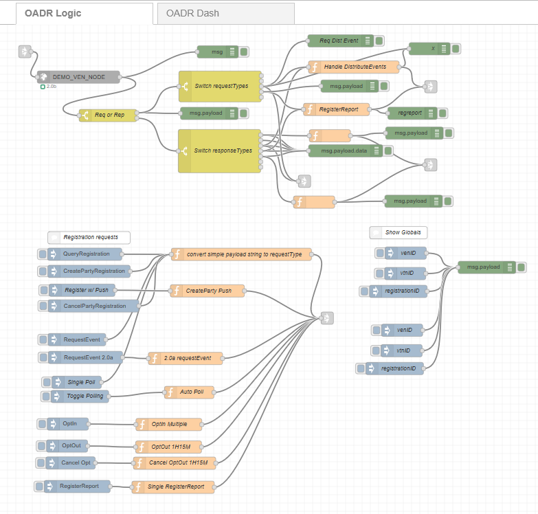

# node-red-contrib-oadr-ven

[](https://nodei.co/npm/@anl-ioc/node-red-contrib-oadr-ven/)

## Open ADR VEN for Node-Red

A [Node-Red][4] node that allows users to easily implement an Open OpenADR ( **Open** **A**utomated **D**emand **R**esponse) VEN (**V**irtual **E**nd **N**ode) by making communication between it and a VTN (**V**irtual **T**op **N**ode) easier. Users only need to deal with json since the node handles converting incoming and outgoing XML messages for them. It also support communication over a secured TCP connection to the VTN.

For more information about OpenADR, please visit the [OpenADR Alliance website][3].

## Implementation

The [Node-Red][4] OADR2 VEN implementation only supports the simpleHttp transport protocol. XMPP is not supported at this time. It also only supports standard security and does not at this time support XML Signatures. 

This implementation attempts to allow users to create OADR 2.0a or 2.0b compatible VEN implementations. Support for earlier OADR releases, or the upcoming 2.0c and future profiles is not supported.

All auto/default Ids (unique ids/ request ids) are generated as [V4 UUIDs][6]. Users can override this and provide their own unique ids and pass them to the commands.

In cases where a command being returned from the VTN has data that can have one or more items (an array), please keep the following in mind: The node attempts to convert incoming XML data structures into json objects. The logic behind this has no way of knowing when an XML path that supports multiple items but is only returning a single item is an array of one item. Therefore the conversion for a single item behaves as if it is not an array. When multiple items are returned however, the items are put into an array. You should always check if an item is an array or not.

## Assumptions

It is not the intention of this document to explain the workings or specification of OADR and its commands. Please refer to the OpenADR profile specification documents provided by the [OpenADR Alliance][3] for details about call parameter requirements and sequences.

## Supported Commands

All commands are sent to the OADR2 VEN node via *`msg.payload`*. This is done in order to support simply using an inject node for simple commands. Many of the commands support default and optional parameters. 

All payloads MUST contain a `requestType` parameter. This is set to the actual oadr command listed below. For simplicity, the commands are given without their *'oadr'* prefix. For example, to make a 2.0b specification call `oadrQueryRegistraion`, set `msg.payload.requestType = 'QueryRegistration'`.

Most of the commands let you define the `requestID` of the command in case you need to track the responses or later requests from the VTN. However, if no `requestID` is submitted with the payload, one will be auto-generated for you. Keep in mind, some commands require you to explicitly return the `requestID` received from another command, for example in the `RegisteredReport` or `CreatedEvent`. Also, some commands have arrays of parameters which may require additional ids.

For 2.0b setups, the OADR2 VEN node also attempts to track the `venID` for you upon receiving it from a `CreatePartyRegistration` call. There is also a configuration parameter for the node which allows you to "hard set" the venID. This is necessary for 2.0a setups, but if set will override the node's saved venID. Optionally, you can pass in the `venID` as a parameter with the commands.

OADR2_VEN support the following commands:
* [QueryRegistration](#queryregistration)
* [CreatePartyRegistration](createpartyregistration)
* [CancelPartyRegistration](#cancelpartyregistration)
* [RequestEvent](*requestevent)
* [CreatedEvent](*createdevent)
* [RegisterReport](*registerreport)
* [RegisteredReport](*registeredreport)
* [Poll](*poll)
* [Response](*response)
* [CreateOpt](*createopt)
* [CancelOpt](*cancelopt)
* [UpdateReport](*updatereport)

### `QueryRegistration`
* `requestID`

Example: (Set this up in a function node and pass it to the OADR2 VEN node)
```javascript
msg.payload = {};
msg.payload.requestType = 'QueryRegistration';
send(msg);
```
Optionally, you can pass in your own requestID
```javascript
msg.payload = {
    requestType: 'QueryRegistration',
    requestID: '1111-22222-3333-QR'
};
send(msg);
```
---
### `CreatePartyRegistration`

* `requestID`
* `oadrProfileName` *(currently defaults and only uses '2.0b' since this command is only supported for 2.0b implementations)*
* `oadrReportOnly` *(true/false  defaults to false)*
* `oadrHttpPullModel` *(true/false defaults to true)*
* `oadrTransportAddress` *(requires URL + port, otherwise it is taken from the config settings)*
---
Example: Register with PUSH
```javascript
msg = {};
msg.payload = {};

msg.payload = { 
    requestType: "CreatePartyRegistration",
    oadrHttpPullModel: false,
    oadrTransportAddress: 'http://192.168.1.100:8843'
};

return msg;
```
---

### `CancelPartyRegistration`
* `requestID`
* `registrationID`
* `venID`

---
### `RequestEvent`
* `requestID`
* `venID`

---
Example: Request Event for 2.0a
```javascript
msg = {};
msg.payload = {};
// Optionally set the venID, otherwise use what is stored in the config
let venID = '48ac6ed956e1f1f4fdbe';

msg.payload = { 
    requestType: "RequestEvent",
    venID
};

return msg;
```
---
### `CreatedEvent`

Generally sent after receiving a `oadrDistributeEvent` from the VTN. 

* `requestID`
* `venID`
* `responseCode`
* `responseDescription`
* `eventResponses`
    * `responseCode`
    * `responseDescription`
    * `requestID`
    * `eventID`
    * `modificationNumber`
    * `optType`

---
### `RegisterReport`
* `requestID`
* `duration`
* `rID`
* `resourceID`
* `reportType`
* `readingType`
* `marketContext`
* `oadrMinPeriod`
* `oadrMaxPeriod`
* `oadrOnChange`
* `reportRequestID`
* `reportSpecifierID`
* `reportName`
* `createdDateTime`
* `venID`

---
### `RegisteredReport`
* `requestID`
* `responseCode`
* `responseDescription`

---
### `Poll`
* `requestID`
* `venID`

example:
```javascript

```
---
### `Response`
* `requestID`
* `responseCode`
* `responseDescription`
---
### `CreateOpt`
* `requestID`
* `optID`
* `optType`
* `optReason`
* `marketContext`
* `resourceID`
* `components`
* `dtstart`
* `dtduration`

---
Single OptOut example set to today+15 days:
```javascript
msg = {};
msg.payload = {};

let d1 = new Date();
d1.setDate(15);

msg.payload = { 
    requestType: "CreateOpt",
    optType: 'optOut',
    optID: '111111111-OUT',
    optReason: 'economic',
    marketContext: 'http://MarketContext1',
    resourceID: 'XYZ',
    dtstart: d1.toISOString(),
    duration: 'PT1H15M'
};

return msg;
```
---
Multiple OptIn example for 3 days:
```javascript
msg = {};
msg.payload = {};

let d1 = new Date();
let d2 = new Date();
let d3 = new Date();
d2.setDate(d1.getDate() + 1);
d3.setDate(d2.getDate() + 1);

let components = [];

let available = {
        properties: {
            dtstart: {
                'date-time': d1.toISOString()
            },
            duration: {
                duration: 'PT5M'
            }
        }
            
    };

available.properties.dtstart['date-time'] = d1.toISOString();
available.properties.duration.duration = 'PT5M';
available.properties['ei:x-eiRampUp'] = {
    duration: 'PT2M'
};
components.push(JSON.parse(JSON.stringify(available)));

available.properties.dtstart['date-time'] = d2.toISOString();
available.properties.duration.duration = 'PT10M';
available.properties['ei:x-eiRampUp'] = {
    duration: 'PT12M'
};
components.push(JSON.parse(JSON.stringify(available)));

available.properties.dtstart['date-time'] = d3.toISOString();
available.properties.duration.duration = 'PT15M';
available.properties['ei:x-eiRampUp'] = {
    duration: 'PT22M'
};
components.push(JSON.parse(JSON.stringify(available)));

msg.payload = { 
    requestType: "CreateOpt",
    optType: 'optIn',
    optReason: 'economic',
    marketContext: 'http://MarketContext1',
    components: components
};

return msg;
```

---
### `CancelOpt`
* `requestID`
* `optID`
* `venID`

---

### `UpdateReport`
*NOTE: Not yet fully supported*

---

## Message output from the OADR2 VEN node

There are two types of messages sent out from the VEN node.

1. Messages from the VTN in response to requests made by the VEN node
1. Requests pushed from the VTN requiring a response from the VEN.

The second type of message should only occur in cases where you set up your VEN to support PUSH from the VTN by providing a URL address into the VEN. This can be for either 2.0a or 2.0b setups.

Messages output from the OADR2 VEN generally contain two structures in the message:

1. `msg.oadr` (which contains...)
    * `requestID`: *(the request id associated with the output message)*
    * `requestType`: *(the request command type, for example CreatePartyRegistrtaion)* 
    * `ResponseType`: *(the returned command type, for example oadrCreatedPartyREgistration)*
    * `pollFreqSeconds`: *(calculated oadrRequestedOadrPollFreq in seconds. Only returned in oadrCreatedPartyRegistration commands)*
1. `msg.payload.data`
    * this structure contains command specific data in json format returned from the VTN. Refer to the OADR 2.0a/b Profile Specifications for parameter details.

## Provided Examples

The package provides a basic example to get you going. In the node-red-contrib-openadr-ven folder is a subfolder named *example-flows*. The example provides a working flow along with a simple UI page on the "OADR Dash" tab. This is by no means a fully functional VEN setup but it should help illustrate how to use the node.

 


# Authors

[Bryan Nystrom][11]

[Argonne National Laboratory][10]

[3]:https://www.openadr.org/
[4]:http://nodered.org
[6]:https://en.wikipedia.org/wiki/Universally_unique_identifier#Version_4_(random)
[10]:https://www.anl.gov
[11]:https://github.com/bnystrom
